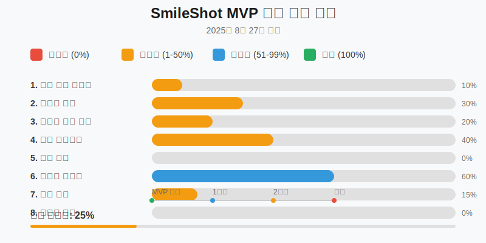

# SmileShot MVP 개선 계획

> 작성일: 2025-08-27  
> 목표: 「하루 1분, 나를 위한 미소」라는 핵심 가치를 전달하는 MVP 완성

## 📊 개선 진행 현황

## 🎯 핵심 개선 사항

### 1. 핵심 가치 명확화
**목표**: "하루 1분 미소 연습"이라는 핵심 가치 강화

#### 현재 문제점
- 1분이라는 시간 개념이 앱에 반영되지 않음
- 매일 연습하도록 유도하는 장치 부족
- 지속성을 위한 동기부여 요소 미비

#### 개선 방안
- [ ] 1분 카운트다운 타이머 기능 추가
- [ ] 일일 리마인더/푸시 알림 기능
- [ ] 연속 연습 일수(Streak) 표시 및 관리
- [ ] 목표 설정 기능 (주 5회, 30일 챌린지 등)

---

### 2. 온보딩 경험 개선
**목표**: 첫 사용자의 진입 장벽 제거

#### 현재 문제점
- 앱 사용법을 직관적으로 이해하기 어려움
- 비회원 체험이 3회로 제한되어 가치 전달 부족
- 왜 이 앱을 써야 하는지 설득력 부족

#### 개선 방안
- [ ] 3-4단계 인터랙티브 튜토리얼 추가
- [ ] 첫 1회는 완전 무료 체험 (제한 없음)
- [ ] 성공 사례/Before-After 예시 화면
- [ ] 앱의 과학적 근거 소개 페이지

---

### 3. 즉각적 가치 전달
**목표**: 첫 세션에서 바로 가치를 느끼도록

#### 현재 문제점
- 첫 연습 후 결과가 명확하지 않음
- 개선 포인트가 너무 복잡하게 제시됨
- 부정적 피드백이 동기를 저하시킴

#### 개선 방안
- [ ] 첫 연습 후 "오늘의 베스트 샷" 즉시 저장 및 표시
- [ ] 개선 포인트 3가지만 간단명료하게 제시
- [ ] 긍정적 피드백 메시지 강화 (칭찬 80%, 개선 20%)
- [ ] 첫 세션 완료 시 축하 애니메이션

---

### 4. 미소 포토 다이어리 강화
**목표**: 핵심 차별화 기능 완성

#### 현재 문제점
- 캘린더에 텍스트만 표시되어 시각적 임팩트 부족
- 성장 과정을 한눈에 보기 어려움
- 베스트 미소 선정 기준이 불명확

#### 개선 방안
- [ ] 캘린더에 미소 사진 썸네일 표시
- [ ] 주간/월간 성장 그래프 (점수 추이)
- [ ] AI 기반 베스트 미소 자동 선정
- [ ] 월별 하이라이트 모음 생성
- [ ] 사진 다운로드 기능

---

### 5. 소셜 증명 및 커뮤니티
**목표**: 함께하는 느낌으로 지속성 향상

#### 현재 문제점
- 혼자하는 연습으로 인한 동기부여 부족
- 성과를 공유할 방법이 없음
- 다른 사용자들의 존재를 느낄 수 없음

#### 개선 방안
- [ ] "지금 n명이 함께 연습 중" 실시간 표시
- [ ] SNS 공유 기능 (인스타그램 스토리 템플릿)
- [ ] 목표 달성 배지 시스템
- [ ] 익명 리더보드 (주간 연습왕)
- [ ] 응원 메시지 주고받기

---

### 6. 기술적 안정성
**목표**: 매끄러운 사용 경험 보장

#### 현재 문제점
- 네트워크 오류 시 데이터 손실
- 카메라 권한 거부 시 불친절한 안내
- 로딩 중 사용자가 불안해함

#### 개선 방안
- [ ] 오프라인 모드 완벽 지원
- [ ] 권한 요청 화면 개선 (왜 필요한지 설명)
- [ ] 스켈레톤 UI 및 로딩 애니메이션
- [ ] 에러 발생 시 복구 가이드
- [ ] 자동 저장 및 동기화 표시

---

### 7. 수익 모델 준비
**목표**: 지속가능한 서비스 구축

#### 현재 문제점
- 무료/유료 기능 구분 없음
- 수익 창출 방안 부재
- 프리미엄 가치 제안 불명확

#### 개선 방안
- [ ] 프리미엄 기능 정의
  - 무제한 히스토리 저장
  - 고급 AI 분석 리포트
  - 전문가 코칭 영상
  - 광고 제거
- [ ] 구독 모델 UI (월 3,900원 / 연 39,000원)
- [ ] 결제 시스템 연동 준비
- [ ] 무료 체험 기간 (7일)

---

### 8. 피드백 루프 구축
**목표**: 사용자 의견 기반 지속 개선

#### 현재 문제점
- 사용자 의견 수집 채널 없음
- 앱 사용 패턴 파악 불가
- 개선 우선순위 설정 어려움

#### 개선 방안
- [ ] 앱 내 피드백 버튼 (플로팅)
- [ ] 세션 종료 후 만족도 조사 (선택적)
- [ ] 이메일 수집 및 월간 뉴스레터
- [ ] Google Analytics 연동
- [ ] A/B 테스트 인프라

---

## ⚡ 실행 우선순위

### 🔴 즉시 실행 (1-2일)
1. 1분 타이머 추가
2. 연속 일수(Streak) 표시
3. 베스트샷 자동 저장

### 🟡 1주일 내
1. 온보딩 튜토리얼
2. 캘린더 썸네일 표시
3. 긍정 피드백 강화

### 🟢 2주일 내
1. SNS 공유 기능
2. 실시간 사용자 수 표시
3. 배지 시스템

### 🔵 1개월 내
1. 푸시 알림 시스템
2. 프리미엄 모델 구축
3. 결제 시스템 연동

---

## 📈 성공 지표 (KPI)

| 지표 | 현재 | 1주 목표 | 1개월 목표 |
|-----|------|---------|-----------|
| 일일 활성 사용자 (DAU) | - | 50명 | 500명 |
| 7일 리텐션 | - | 40% | 60% |
| 평균 세션 시간 | - | 3분 | 5분 |
| 유료 전환율 | 0% | - | 5% |
| 앱스토어 평점 | - | 4.0 | 4.5 |

---

## 📝 개발 로그

### 2025-08-27
- MVP 개선 계획 수립
- 비회원 무료 체험 3회로 조정
- 번역 키 오류 수정
- UI/UX 개선 사항 정리

---

## 💬 메모
- 핵심은 "매일 1분"이라는 작은 습관 형성
- 완벽한 미소가 아닌 "나만의 자연스러운 미소" 찾기
- 기술보다는 사용자 경험과 가치 전달에 집중
- MVP는 핵심 기능만 완벽하게